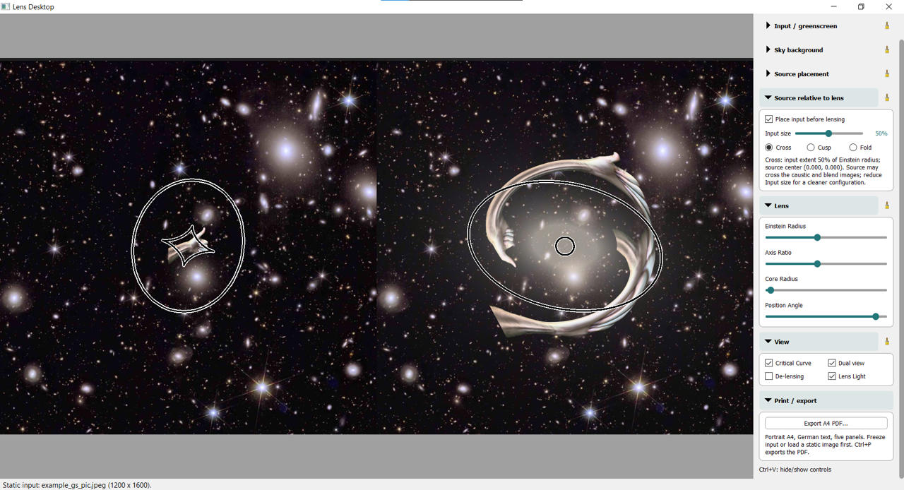

# Lens Desktop

Lens Desktop applies a softened SIE gravitational-lens model to a live desktop
capture, a webcam, or a still image. The window shows the result as you adjust
the lens and view settings.



## Install and run

From PowerShell, create an environment and install the application dependencies:

```powershell
py -3.12 -m venv .venv
.\.venv\Scripts\python.exe -m pip install numpy scipy opencv-python PyQt5 mss
.\.venv\Scripts\python.exe -m LensDesktop
```

Run the command from the repository folder. On macOS, install `pyobjc` and
`pyobjc-framework-Quartz` in the environment as well. The operating system may
ask for permission to capture the screen or use the camera.

To build the packaged application, install PyInstaller and run:

```powershell
.\.venv\Scripts\python.exe -m pip install pyinstaller
.\.venv\Scripts\pyinstaller.exe --noconfirm LensDesktop.spec
```

## Using the GUI

The settings panel sits beside the image. Its sections are **Source**,
**Input / greenscreen**, **Sky background**, **Source placement**,
**Source relative to lens**, **Lens**, **View**, and **Print / export**. Click a
section header to expand or collapse it. The reset icon in a settings header
restores that section's values from [`data/defaults.ini`](data/defaults.ini);
Source returns to its configured default image and Sky background restores the
bundled sky.

The window stays square in single view and shows two side-by-side panels in
Dual view. Drag the image to move the window. Right-click the image in
**Composed scene** to add or remove a marker. **Ctrl+V** hides the settings
panel and toggles the window frame for presentation.

### Choose an input

The input menu lists **Static image**, **Webcam**, and **Desktop**, in that
order. Lens Desktop starts with the supplied [Hand example](data/example_gs_pic.jpeg);
it does not open or scan for a webcam automatically.

To use a webcam, expand **Camera setup** under Source, click **Refresh** and
select a camera, or enter its index and click **Use index / retry**. Then choose
**Webcam** from the input menu. Camera indices can vary between systems. A
failed camera switch leaves the current input in place.

When a webcam is connected, the prominent **Freeze webcam** button captures
the current frame and releases the camera. Click **Resume webcam** to reconnect
that camera. The toggle is disabled until a webcam has connected.

Choose **Desktop** to capture the area behind the Lens Desktop window. Choose
**Static image** to return to the last loaded or frozen image. **Load image...**
opens another PNG or JPEG; **Hand example** reloads the bundled sample.
**Save input...** saves the original pixels before framing, mirroring, keying,
lensing, or overlays.

### Greenscreen and input framing

Enable **Remove greenscreen** to make the selected color transparent. The key
color, hue tolerance, edge softness, minimum saturation, and spill suppression
are adjustable in **Input / greenscreen**. The values used at startup are set
in `data/defaults.ini`.

The **Preview** menu offers:

- **Composed scene** — the input after lensing, over the selected sky.
- **Original source** — the framed input before keying and lensing.
- **Alpha mask** — white is kept, black is removed, and gray is partly
  transparent.

**Input framing** offers source default, Fit, and Fill. Fit shows the whole
image; Fill center-crops it. **Mirror** can follow the source default or be set
explicitly. Loaded images and desktop captures are unmirrored; webcam images
are mirrored by default. **Input zoom** crops the center before lensing: 100%
shows the full input, 200% keeps half of each axis, and 400% keeps a quarter.

### Lens and source placement

The **Lens** section contains **Einstein Radius**, **Axis Ratio**, **Core
Radius**, and **Position Angle**. **Mask Radius** appears in De-lensing mode.
The **View** section contains **Critical Curve**, **Dual view**, **De-lensing**,
and **Lens Light**.

**Source placement** scales and moves the rendered source after lensing. Its
size ranges from 10% to 200% of an image panel; horizontal and vertical offsets
are percentages of the panel dimensions. This does not move the lens or affect
the sky.

Enable **Place input before lensing** in **Source relative to lens** to use the
**Cross**, **Cusp**, and **Fold** presets. They position the input relative to
the lens's caustic before lensing. Input size controls the source extent as a
percentage of the Einstein radius. Greenscreen removal can help isolate the
subject from the rest of the image. These presets require forward lensing and a
usable tangential caustic; the app reports invalid lens settings in the status
area.

The sky is not lensed. **Sky background** can load a PNG or JPEG, clear it to a
black background, or restore the bundled [Abell 2764 image](data/euclid_abell_2764_example.jpeg).
**Fill** crops the sky to cover the image; **Fit** shows the whole image with
black margins. Sky credits and license information are listed in
[data/README.md](data/README.md).

### Export an A4 PDF

Use a still image, the Hand example, or freeze a webcam frame. A4 export
requires forward lensing. Click **Export A4 PDF...** in **Print / export** or
press **Ctrl+P**. The PDF contains five panels: the original image, the keyed
input, the source plane with its caustic, the lensed image with its critical
curve, and the final montage over the selected sky.

The final montage never includes the critical curve, regardless of the GUI
toggle. Lens light is included in the montage. The PDF is one portrait A4 page
rendered at 300 DPI; text and diagnostic curves are vector elements. To print,
open the saved PDF in a PDF viewer.

Bundled sky images include their credits and license in the PDF. For a custom
sky, the PDF shows the filename, but it cannot identify the owner or license.

## Keyboard shortcuts

| Shortcut | Action |
| --- | --- |
| **Ctrl+S** | Save the displayed scene or diagnostic preview. |
| **Ctrl+P** | Export an A4 PDF. |
| **Ctrl+F** | Switch between Desktop and the selected webcam, or open camera controls if none is selected. |
| **Ctrl+R** | Save a sequence while increasing the Einstein radius. |
| **Ctrl+L** | Toggle the heart-shaped lens effect. |
| **Ctrl+V** | Hide or restore the settings panel and window frame. |

## Defaults and tests

Edit `data/defaults.ini` to change startup values and section reset values.
Lens Desktop reports a missing or invalid defaults file at startup.

Run the test suite from the repository folder:

```powershell
$env:QT_QPA_PLATFORM = "offscreen"
.\.venv\Scripts\python.exe -m unittest discover -s tests -v
Remove-Item Env:QT_QPA_PLATFORM
```

Webcam access, screen-capture permissions, and display scaling depend on the
system and should be checked on the target machine.

## Acknowledgements

This software is based on the initial [LensDesktop](https://github.com/WolfgangEnzi/LensDesktop) software by Wolfgang Enzi, modified by Fabian Balzer to be used as a demonstrational tool for outreach purposes at the Max Planck Institute for Extraterrestrial Physics.

### AI Usage disclaimer

This software was developed with help of Codex.

Copyright (c) 2026, Wolfgang Enzi, Fabian Balzer
